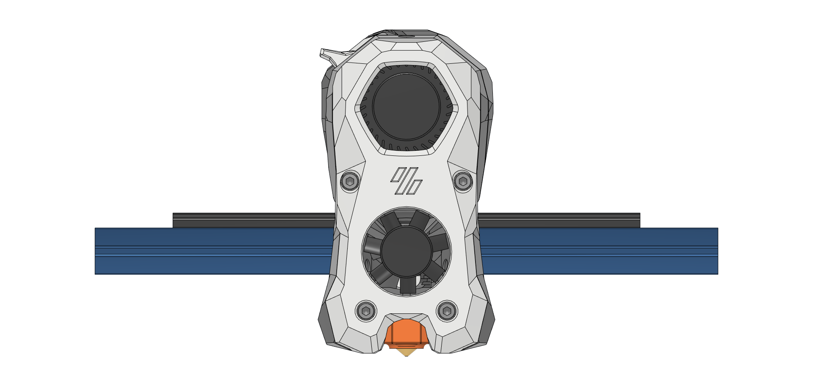
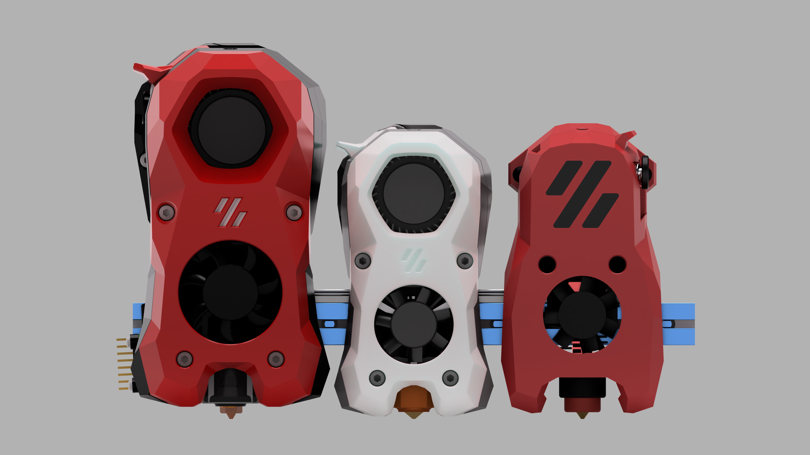
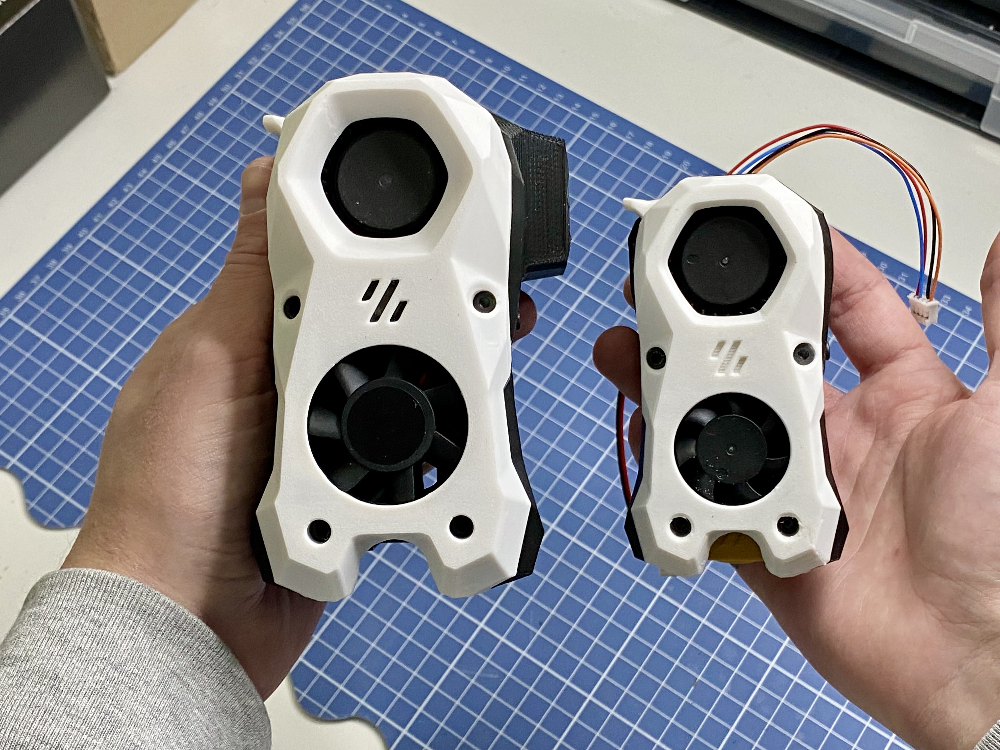
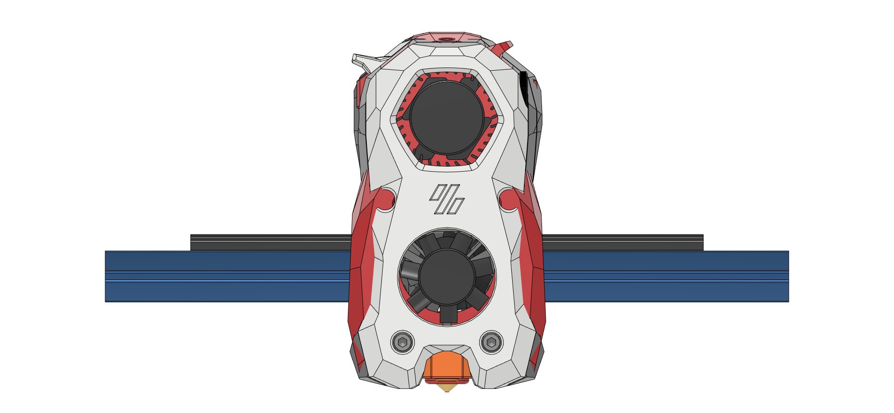
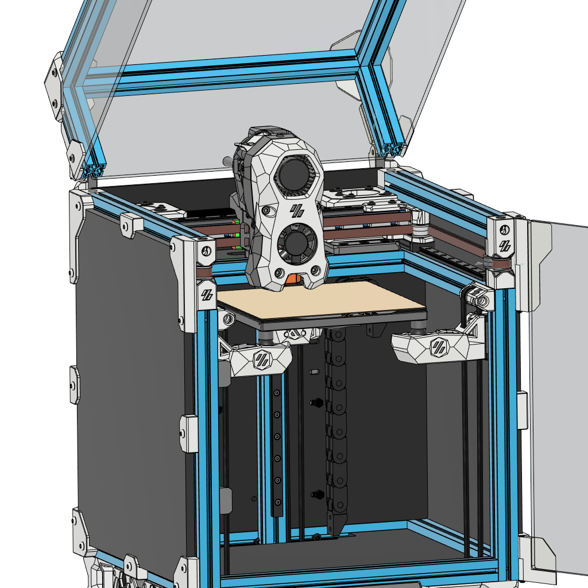

# WTH-Burner
~~What the hell~~ Washed too hot Stealth**burner** - a scaled down Stealthburner for the tiny Vorons

 

### Work in Progress

This is still in progress and not ready to be printed, but I thought I could start the Repo already to collect some information. So some specs arounf the Wth-Burner:

- 80% scaled Stealthburner that fit's the tiny Vorons like the V0 (more information below)
- 4020 for Part-cooling (like from the Afterburner) and 3007 for Hotend-cooling
- CW2 extruder with adapted internals to fir the small formfactor
- Full size nozzle LEDs - same as for his big brother (Logo LED is on the TO-Do)
- Compatible with Phaethus Dragon, Red lizard and Dragonfly-BMO (I would recommend a ceramic heater due the tight space)
- Weight of 265g (Phaethus Dragon SF + 17mm 10T Moons)  

### CAD Preview

This is only a web preview, I will share all the files once I confirmed it's working :)

Link: https://a360.co/43DYPun

### What's the catch?

... Y travel. The Wth-Burner is 9mm thicker than the Mini SB, which can limit the Y travel.

#### Voron V0.2

A stock [V0.2](https://github.com/VoronDesign/Voron-0) has ~1mm clearance to the front panel, when the nozzle sits at the very front. That means you would loose 8mm of Y travel - only you can tell if you print to the very edge of your bed

##### Solution: Pandora Gantry:

A very easily solution would be the [Pandora Gantry](https://github.com/MasturMynd/Pandora), which gives you more Y travel. With this you shouldn't have any space limitations (untested). I will use the Pandora Gantry in my V0, so I will be able to confirm that, once I finished the build.

#### Voron Micron

A stock [Micron](https://github.com/PrintersForAnts/Micron) has a little more Y travel than needed - as far I can tell from the CAD, I will have to see how that applies to the real thing once I build mine.

1: Stealthburner - Wth-Burner - Mini-Stealthburner |  2: Wth-Burber - Mini SB |  3: Wth-Burner in TriBall (my V0 with kinematic triple z)
:-------------------------:|:-------------------------:|:-------------------------:
  |    |  
